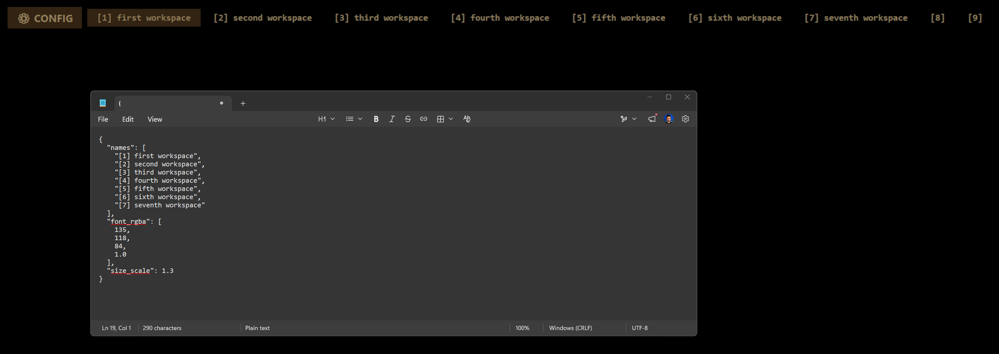

# Desktop Labeller

Desktop Labeller is a small Windows utility that displays clickable labels for your Windows virtual desktops. It places a low-profile Tkinter overlay near the top-left of the desktop, highlights the active desktop, and lets you switch desktops by clicking a label.

## Requirements

- Windows 10 or Windows 11 with Virtual Desktops enabled
- Python 3.10 or newer
- PowerShell 5.1 or newer
- Inno Setup 6 if you want to build the Windows installer
- Python packages:
  - `pyvda`
  - `pywin32`
  - `pyinstaller` if you want to build the executable

## Install Dependencies

If Python is not installed yet, install Python 3.10 or newer first.

Using Windows Package Manager:

```powershell
winget install Python.Python.3.12
```

Or download the Windows installer from the official Python website. During setup, enable **Add python.exe to PATH** before clicking **Install Now**.

After installation, open a new PowerShell window and verify Python is available:

```powershell
python --version
```

If that opens the Microsoft Store instead of showing a Python version, turn off the Python app execution aliases in Windows Settings under **Apps > Advanced app settings > App execution aliases**, then open a new PowerShell window and try again.

From the project folder, install the runtime dependencies:

```powershell
pip install pyvda pywin32
```

If you want to build the standalone executable, also install PyInstaller:

```powershell
pip install pyinstaller
```

To build the Windows installer, install Inno Setup 6 from the official Inno Setup site and make sure `ISCC.exe` is available either on your `PATH` or in the default Inno Setup install folder.

## Run From Source

Start the overlay directly with Python:

```powershell
python .\workspace_label.py
```

On first launch, the app creates a per-user config file at:

```powershell
$env:LOCALAPPDATA\Desktop Labeller\desktops.json
```

The JSON config controls the displayed workspace names, text color, label surface color, and overlay scale:

```json
{
  "names": [
    "[1] first workspace",
    "[2] second workspace",
    "[3] third workspace",
    "[4] fourth workspace",
    "[5] fifth workspace",
    "[6] sixth workspace",
    "[7] seventh workspace"
  ],
  "font_rgba": [
    135,
    118,
    84,
    1.0
  ],
  "surface_rgba": [
    2,
    2,
    2,
    1.0
  ],
  "size_scale": 1.3
}
```



If you have more virtual desktops than names, the app falls back to numbered labels such as `[8]`. The `font_rgba` value uses red, green, blue, and alpha values. The `surface_rgba` value (same red, green, blue, alpha format) sets the clickable background painted behind each label; it defaults to a near-black `[2, 2, 2, 1.0]` so the whole padded label area is clickable while staying nearly invisible. The `size_scale` value accepts `0.5` through `3.0`, where `1.0` is the default size.

The config file is parsed as JSONC, so you can add `//` line comments to annotate your settings.

#### Choosing which monitors to use

By default the overlay is rendered on **every** monitor, using the single config object at the top level (this is the "flat" form shown above).

To render **different** configs on **different** monitors, replace the flat object with one or more `desktop:` keyed blocks. Each key names the 1-based monitor indices it applies to, and its value is a full config object (names, colors, scale, and any `opt_feature_*` features):

```jsonc
{
  // Big labels with shortcuts on the first and third monitors.
  "desktop:1,3": {
    "names": ["Work", "Web", "Chat", "Media"],
    "size_scale": 1.5,
    "opt_component_feature_shortcuts": {
      "entries": [{ "label": "Notepad", "path": "notepad.exe" }]
    }
  },
  // A smaller, plainer overlay on the second monitor.
  "desktop:2": {
    "names": ["Work", "Web", "Chat", "Media"],
    "size_scale": 1.0
  }
}
```

Rules for `desktop:` blocks:

- Indices are **1-based**. Index `1` is the left-most monitor; monitors are ordered left-to-right, then top-to-bottom (matching how Windows Display Settings arranges them).
- A single key can list several monitors, e.g. `"desktop:1,2,3"`.
- A bare `"desktop"` key (or `"desktop:"` with no indices) means **all monitors**. This is handy for a default block: pair it with more specific keys to override individual monitors, e.g. `"desktop"` for everything plus `"desktop:2"` for one different monitor.
- You may declare as many `desktop:` keys as you like, each with its own independent config (different names, colors, scale, and features per monitor).
- Only the monitors named by a `desktop:` key get an overlay; unlisted monitors stay clear.
- If the **same** index appears in more than one key, the block that comes **later** in the file wins.
- Any index outside the available range is ignored. If none of the listed indices match a connected monitor, the first defined block is shown on the primary monitor so the overlay (and its config gear) stays reachable.
- If there are **no** `desktop:` keys at all, the whole object is treated as one flat config rendered on every monitor (backward compatible).
- The overlay automatically rebuilds itself when a monitor is plugged in or unplugged.


#### Optional toolbar features

A toolbar can appear underneath the workspace list, populated by optional features you enable in the config. Each feature is declared with an `opt_feature_*` key whose value is an object of settings.

```jsonc
{
  "names": ["Work", "Web", "Chat", "Media"],
  // Adds a button that moves the focused window to the next workspace you click.
  "opt_toolbar_feature_movewindow": {
    "label": "Move Window"
  },
  // Adds a button that pins/unpins the focused window across all workspaces.
  "opt_toolbar_feature_pinwindow": {
    "label_pin": "Pin Window",
    "label_unpin": "Unpin Window"
  }
}
```

`opt_toolbar_feature_movewindow` adds a button to the toolbar. Click it to arm move mode: the button highlights and its text changes to **Select window.** Click (focus) the window you want to move and the text changes to **Select workspace.**; then click a workspace label to send that window to the chosen virtual desktop. Click the button again to cancel. Its `label` property sets the button's idle text and defaults to `Move Window`.

`opt_toolbar_feature_pinwindow` adds a button that pins or unpins the currently focused window so it stays visible across every virtual desktop. The button automatically reflects the focused window's current state: it shows `label_pin` (default `Pin Window`) when the window is not pinned and `label_unpin` (default `Unpin Window`) when it is. Clicking the button flips that state for the focused window.

`opt_component_feature_shortcuts` adds a grid of clickable shortcuts that launch programs or files. It takes two properties:

- `column_count` (integer `>= 1`) — how many columns to split the shortcut list across. Entries fill left-to-right, top-to-bottom.
- `entries` — a list of shortcut objects. Each entry supports:
  - `label` — the text shown on the shortcut (falls back to `path` if omitted).
  - `path` — the program or file to open (required). Environment variables such as `%LOCALAPPDATA%` are expanded.
  - `arguments` — optional command-line arguments passed when launching.
  - `opt_icon` — optional path to a `PNG`/`GIF` icon. If omitted or it fails to load, a placeholder glyph is shown instead.

It also accepts two optional border properties that, when both are set, draw a border around the whole shortcut grid:

- `border_width` — a non-negative integer thickness (in pixels, scaled with `size_scale`).
- `border_color` — either an RGBA list (same format as `font_rgba`) or a hex string such as `"#FFB300"`.

```jsonc
{
  "names": ["Work", "Web", "Chat", "Media"],
  "opt_component_feature_shortcuts": {
    "column_count": 2,
    "border_width": 1,
    "border_color": "#554422",
    "entries": [
      { "label": "Notepad", "path": "notepad.exe" },
      {
        "label": "Project A",
        "path": "C:\\Windows\\explorer.exe",
        "arguments": "E:\\projects\\Desktop-Labeller",
        "opt_icon": "C:\\icons\\folder.png"
      }
    ]
  }
}
```

`opt_feature_notifications` marks a workspace label when one of its windows requests attention (the same signal that flashes a taskbar button — for example a Teams/Slack/Discord ping or a dialog needing input). The mark appears on the corresponding label on every monitor whose config enables this feature, so you can see at a glance which workspace wants you. It takes two optional properties:

- `indicator` — the glyph appended to a flagged workspace label (defaults to `●`).
- `color` — the indicator/label color while flagged, as a hex string such as `"#FF3333"` or an RGBA list (same format as `font_rgba`).

```jsonc
{
  "names": ["Work", "Web", "Chat", "Media"],
  "opt_feature_notifications": {
    "indicator": "●",
    "color": "#FF3333"
  }
}
```

A mark clears automatically when you switch to that workspace, or when you activate the window that was asking for attention. Notifications on the workspace you are currently viewing are flagged too; they clear once you focus the relevant window. Note that this detects taskbar "needs attention" flashes — not arbitrary toast/notification-center popups, which Windows does not expose per window.

If an older local `desktops.txt` exists beside the script, the app copies those names into the AppData JSON config the first time it creates the new config file.

Click the gear at the far left of the overlay to open the config file in your default text editor. Saved changes are picked up automatically while the overlay is running.

## Build the Executable

Build the bundled app with the included PyInstaller spec file:

```powershell
pyinstaller .\workspace_label.spec
```

The generated executable is written under `dist\workspace_label\workspace_label.exe`.

## Build the Windows Installer

Build the PyInstaller app bundle and compile the installer with:

```powershell
.\build_installer.ps1
```

The generated installer is written to:

```text
installer-output\Desktop-Labeller-Setup.exe
```

If you have already rebuilt the PyInstaller output and only want to recompile the installer, run:

```powershell
.\build_installer.ps1 -SkipPyInstaller
```

The installer uses Inno Setup and installs Desktop Labeller into the current user's local programs folder. During installation, you can optionally create a desktop shortcut or start the app automatically when you sign in.

## Control the Built App

After building, use the PowerShell controller script:

```powershell
.\controller.ps1 -Start
.\controller.ps1 -Stop
.\controller.ps1 -Restart
```

The controller looks for `workspace_label.exe` in the project folder, `dist\`, or `dist\workspace_label\`.

## Optional Windows Service

The controller can also register and remove a Windows service:

```powershell
.\controller.ps1 -RegisterService
.\controller.ps1 -RemoveService
```

Run PowerShell as Administrator for these commands. Because Windows services run outside the normal interactive desktop session, direct startup with `-Start` is usually the better option for an overlay that needs to appear on your desktop.

## Customization

- Edit `$env:LOCALAPPDATA\Desktop Labeller\desktops.json` to rename the virtual desktop labels.
- Click the gear at the far left of the overlay to open the labels config directly.
- Change `font_rgba` in the JSON config to set the label text color.
- Change `surface_rgba` in the JSON config to set the clickable background behind each label.
- Change `size_scale` in the JSON config to resize the overlay.
- Change the `root.geometry("+20+20")` value in `workspace_label.py` to move the overlay.
- Change `lbl.pack(side="left", padx=2)` to `side="top"` in `workspace_label.py` if you prefer a vertical list.

## Performance

Desktop Labeller is built to stay effectively invisible to your CPU and GPU while it sits on the desktop. It is a single lightweight Tkinter overlay (one window per monitor it renders on) and spends almost all of its time idle.

- **Low-frequency polling.** A single timer loop runs about every 400 ms to check the active desktop, monitor layout, and config file. There is no busy-waiting or per-frame rendering.
- **Event-driven notifications.** The `opt_feature_notifications` feature reacts to Windows shell-hook messages (the same taskbar-flash signal), so it does no extra polling — it only does work when a window actually requests attention.
- **Idempotent repaints (no idle redraw).** Widgets are reconfigured only when something actually changes (the active desktop, a window's pin state, or the config file). Because the overlay uses a layered `-transparentcolor` window, reconfiguring widgets every tick would force Windows to recomposite the whole window, so the loop deliberately skips that work when nothing changed. The practical effect is zero ongoing GPU compositing while you stay on one desktop.
- **Focus-gated window ordering.** When pinned to the background, the overlay only re-asserts its bottom-most z-order when the foreground window changes, not on every tick — avoiding needless `SetWindowPos` churn (and the recompositing it would trigger).
- **Fullscreen yield.** When a fullscreen app (e.g. a game or full-screen video) is in the foreground, the overlay withdraws its windows and slows its loop to about once per second, so it cannot affect the game's frame rate or the compositor and stays essentially dormant until you return to the desktop.
- **Config reloads only on change.** The config file is re-read and the overlay rebuilt only when the file's modification time changes (or a monitor/desktop is added or removed), not on a schedule.

In practice the app idles at a negligible fraction of one CPU core and adds no continuous GPU load. Rebuilds (config edits, monitor hot-plug, desktop count changes) are brief one-off operations.

## Troubleshooting

- If the overlay does not appear, confirm that the process is running and that Windows virtual desktops are available.
- If labels are missing, check `$env:LOCALAPPDATA\Desktop Labeller\desktops.json` and restart the app.
- If the overlay shows `JSON: Bad format`, fix the JSON syntax in the config file and save it.
- If desktop switching does not work, reinstall `pyvda` and make sure the app is running on Windows.
- If controller commands fail to find the executable, rebuild with PyInstaller or place `workspace_label.exe` beside `controller.ps1`.
- If installer creation fails with `ISCC.exe was not found`, install Inno Setup 6 or add its install folder to your `PATH`.
